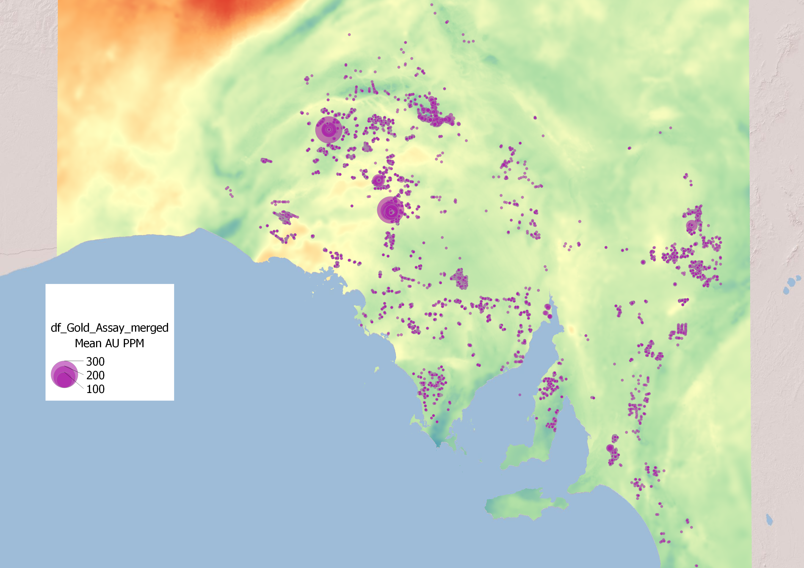

## Data Extraction & Exploration - Explore SA | The Gawler Challenge
###### Russell Menezes | RadixGEO

In these series of four notebooks I go though the **sarig_dh_details_exp** dataset and integrate it with the **sarig_rs_chem_exp** dataset. The focus here, is mainly on the different data ingestion and exploration techniques, with a special focus on working with large datasets. CSV's which are of the order of several GB in size are difficult to process as they can't opened and processed the conventional way on computers with standard RAM configurations. The final product at the end of this series may or may not be usefull to many but the techniques and ideas demonstrated here will definitely help you put together your own unique dataset on which, probably, the winning model will be built!

To summarize the four notebooks - 

1. We look at the *sarig_dh_details_exp.csv* file which seem to be the catalog containing meta-data for the drill holes. We explore and dissect this dataset to extract information on the gold commodity.

2. The *sarig_dh_details_Gold.csv* dataset is a massive file containging assay information on the drill holes in this region. In orderd to integrate this information with the catalog, we identify the row numbers that we need to extract from this massive csv which correspond to the drill hole numbers in the catalog dataset.

3. Here, we use the index (row) numbers obtained from the previous process to extract only those row numbers in chunks from the *sarig_dh_details_Gold.csv* dataset.

4. The two data sets we have now have a one to many relationship, i.e. for every DH number in the catalog file we have several rows of assay information. We explore techniques in this notebook on how to merge data with such relationships and present them effectively.

This is our final product.

